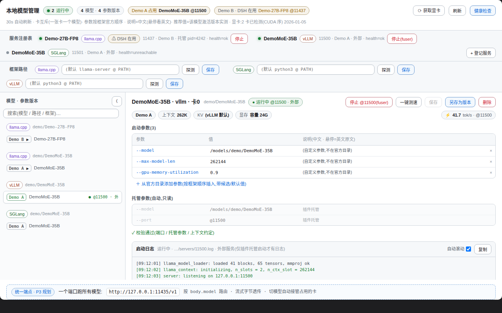

# dsh-model-manager

**Languages: [English](README.en.md) | [中文](README.md)**

A control panel for your local LLM inference servers — a plugin for DSH (DeepSeek Harness).



## Why

Run a couple of local inference servers (llama.cpp / SGLang / vLLM) and the parameter knowledge scatters across terminal history and notes: which `-c` / `-np` does this model want? Does the VRAM actually fit? Which framework boots on this card?

With this plugin, the answers live in one panel:

- Before: digging through shell history, hand-calculating KV memory, learning about over-budget configs from an OOM.
- After: a service registry that shows who runs on which card in real time, parameter profiles validated for VRAM before you save, one-click tok/s benchmarks.

## Quick start

**Prerequisites**: DSH (with web) + pnpm; GPU detection needs python3 (falls back to `nvidia-smi` when missing).

```bash
cd ~/.dsh/profiles/web                      # your DSH web profile directory
pnpm add github:Ansonfishing/dsh-model-manager
```

Then add `"dsh-model-manager"` to the `dsh.profile.bundles` array in `package.json` and restart `dsh`. A "Model Manager" tab appears in the conversation view — done.

## Features

- **Service registry** — register local inference servers (port, framework, model, GPU) with live health checks and one-click stop.
- **Parameter profiles** — named parameter versions per "model × framework × GPU" for llama.cpp / SGLang / vLLM. Rows follow a fixed 9-group order (model → context → KV → speculative decoding → sampling → performance → parallelism → server → misc); different quantizations of the same model × framework share one union row set with aligned rows — flags unset in the current version show as grey "other quant: value" rows, so cross-quant differences pop out. Recommended values resolve through a 3-tier provenance chain (same-quant live value → sibling quant → official best practice), labelled per cell; nothing is guessed.
- **GPU detection** — auto-enumerates cards (`libcuda` primary, `nvidia-smi` fallback); card index = the `CUDA_VISIBLE_DEVICES` value.
- **VRAM validation** — estimates KV memory from `-c` / `-np` when you save a profile and warns immediately if the target card can't hold it.
- **One-click benchmark** — sends a fixed prompt (non-streaming, 256 tokens) to a running server and records tok/s; a full-context hot benchmark additionally verifies the usable context is at least the target, then runs streaming warmup + measurement (TTFB / prefill / decode).
- **Safety rails** — never uses `pkill`; stopping an external service requires explicit force plus a two-click confirmation in the panel; stopping port 11437 (DSH's own inference port) additionally warns that it will interrupt the current session.

## No DSH? Take a look anyway

Clone this repo and open `test/harness/index.html` in a browser — a zero-dependency render harness that shows the full panel with mock data; `?chrome=0` hides the harness bar.

## Local GPU table (optional)

The repo ships no hardcoded GPU mappings. To show card names and memory capacity, create `~/.dsh/model-manager/builtin-gpus.local.json`:

```json
{
  "0": { "name": "RTX 4090", "memGb": 24 },
  "1": { "name": "RTX 6000 Ada", "memGb": 48 }
}
```

Without the file the panel falls back to "GPU 0 / GPU 1" and skips VRAM validation.

## Development

```bash
npm test                          # node --test test/*.test.mjs
node build/build-client.cjs       # rebuild lib/client.js from mockup-v3.html
```

Local development: after cloning, use `pnpm add link:../path/to/dsh-model-manager` in your profile. Client-only changes need a browser refresh; Node-side changes (`index.js` / `lib/*.js`) need a `dsh` restart.

## Architecture at a glance

| Layer | File | Responsibility |
|---|---|---|
| Entry | `index.js` | registers 14 tools + 17 same-origin routes |
| Lifecycle | `lib/lifecycle.js` | registry CRUD, health probes, managed start/stop |
| Safety | `lib/safety.js` | stop policy (fuser/kill), protected ports |
| Validation | `lib/validate.js` | launchCommand parsing + rule engine |
| GPU | `lib/gpu.js` | detection + local GPU table loading |
| Adapters | `lib/adapters/*.js` | llama / sglang / vllm command assembly |
| Client | `lib/client.js` | single-file React component (built from the mockup) |

## License

[MIT](LICENSE) © Ansonfishing
